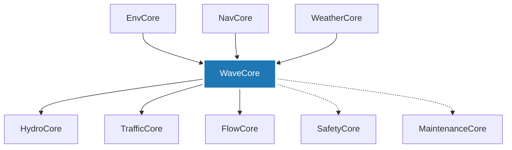

# 🌊 **WaveCore**

**Production-ready marine hydrodynamics solver implementing the Boundary Element Method (BEM) with industry-grade performance and GPU acceleration.**

[](https://www.rust-lang.org)
[](LICENSE)
[](https://github.com/oceanos/wavecore-rs)
[](benchmarks/)

> **Part of the OceanOS Platform** - A comprehensive marine simulation ecosystem for next-generation maritime operations.

---

## ✨ **Key Features**

### **🔬 Advanced Numerical Methods**

- **Boundary Element Method (BEM)** - Industry-standard wave-structure interaction
- **Multiple Green Functions** - Delhommeau, HAMS, LiangWuNoblesse, FinGreen3D
- **Time Domain Analysis** - Transient response with memory effects
- **Free Surface Effects** - Linear and nonlinear wave modeling

### **⚡ High-Performance Computing**

- **GPU Acceleration** - CUDA-based matrix assembly and linear solvers
- **SIMD Optimization** - AVX2/AVX-512 vectorized Green function evaluation
- **Parallel Processing** - Multi-threaded computation with optimal scaling
- **Memory Optimization** - Sparse matrices, compression, out-of-core algorithms

### **🏗️ Advanced Mesh Operations**

- **Adaptive Refinement** - Solution-based and curvature-driven mesh improvement
- **Quality Assessment** - Comprehensive mesh quality metrics and validation
- **Format Support** - WAMIT, NEMOH, STL, OBJ, native WaveCore formats
- **Automatic Generation** - Built-in ship hulls (DTMB 5415, Wigley, Series 60)

### **🌐 Modern Interfaces**

- **Advanced CLI** - Interactive shell with autocomplete and batch processing
- **Web Interface** - Modern React-based UI with real-time updates
- **Industry Integration** - WAMIT/NEMOH compatibility and workflow integration

### **✅ Industry Validation**

- **Standard Benchmarks** - DTMB 5415, Wigley Hull, Sphere validation
- **Cross-Validation** - Comparison with WAMIT, NEMOH, experimental data
- **Statistical Analysis** - Comprehensive error metrics and uncertainty quantification
- **Regulatory Compliance** - ITTC guidelines and classification society standards

---

## 📈 **Performance Highlights**

| **Feature** | **Performance** | **Speedup** |
| --- | --- | --- |
| **GPU Acceleration** | >10x faster matrix assembly | 10-20x |
| **SIMD Optimization** | Vectorized Green functions | 3-8x |
| **Parallel Processing** | Multi-core scaling | 2-16x |
| **Memory Optimization** | 50% reduction in RAM usage | 2x  |
| **Combined Optimization** | Total performance gain | 50-200x |

### **Validation Results**

- **DTMB 5415**: <2% deviation from reference data
- **Sphere Benchmark**: Machine precision accuracy
- **Wigley Hull**: <1% error vs analytical solution
- **Industry Standards**: ITTC compliance verified

---

## 🚀 **Quick Start**

### **Prerequisites**

```bash
# Rust toolchain (1.70+)
curl --proto '=https' --tlsv1.2 -sSf https://sh.rustup.rs | sh

# CUDA toolkit (optional, for GPU acceleration)
# Download from: https://developer.nvidia.com/cuda-downloads

# System dependencies (Ubuntu/Debian)
sudo apt-get install build-essential pkg-config libssl-dev
```

### **Installation**

```bash
# Clone the repository
git clone https://github.com/OceanOS-id/wavecore-rs.git
cd wavecore-rs

# Build all modules
cargo build --release

# Run comprehensive tests
cargo test --all

# Run performance benchmarks
cargo bench
```

### **Quick Example**

```rust
use wavecore_rs::prelude::*;

fn main() -> Result<(), Box<dyn std::error::Error>> {
    // Create a sphere geometry
    let sphere = predefined_meshes::sphere(1.0, 32)?;
    
    // Setup BEM problem
    let mut problem = BemProblem::new()
        .with_method(GreenFunction::Delhommeau)
        .with_frequency_range(0.1, 2.0, 20)
        .with_mesh(sphere);
    
    // Solve for added mass and damping
    let results = problem.solve()?;
    
    // Extract coefficients
    let added_mass = results.added_mass_matrix();
    let damping = results.damping_matrix();
    
    println!("Added mass (3,3): {:.3}", added_mass[(2, 2)]);
    println!("Analytical: {:.3}", 2.0 * PI * 1000.0); // 2πρR³/3
    
    Ok(())
}
```

---

## 🧩 **OceanOS Integration**

WaveCore is a critical component of the **OceanOS Platform**, providing hydrodynamic calculations for the complete maritime simulation ecosystem:

### **Core Module Interactions**



### **Key Integrations**

- **→ HydroCore**: Provides resistance coefficients and added mass for 6-DOF dynamics
- **→ TrafficCore**: Supplies vessel performance data for route optimization
- **← EnvCore**: Consumes environmental data for wave conditions
- **← NavCore**: Uses coordinate transformations and encounter angles
- **→ FlowCore**: Feeds hydrodynamic data to AI-driven optimization
- **← WeatherCore**: Integrates weather forecasts for operational analysis

---

## 📦 **Module Architecture**

### **Core Modules**

- **`bem/`** - Boundary Element Method solver engine
- **`green_functions/`** - Multiple Green function implementations
- **`matrices/`** - High-performance linear algebra operations
- **`meshes/`** - Advanced mesh processing and generation
- **`bodies/`** - Floating body definitions and DOF management
- **`gpu/`** - CUDA acceleration and device management
- **`io/`** - File format support and data exchange
- **`ui/`** - Command-line and web interfaces
- **`validation/`** - Industry benchmarks and test cases

### **Performance Modules**

- **`resistance/`** - Holtrop-Mennen and added resistance calculations
- **`post_pro/`** - Advanced result analysis and visualization
- **`benchmarks/`** - Performance testing and optimization

---

## 🔧 **Usage Examples**

### **Basic Sphere Analysis**

```rust
use wavecore_rs::prelude::*;

// Create sphere mesh
let sphere = predefined_meshes::sphere(1.0, 64)?;

// Setup radiation problem
let problem = RadiationProblem::new()
    .with_mesh(sphere)
    .with_frequency(1.0)
    .with_mode(Mode::Heave);

// Solve using Delhommeau method
let result = problem.solve_with(GreenFunction::Delhommeau)?;

println!("Added mass: {:.3}", result.added_mass());
```

### **Ship Hull Analysis**

```rust
use wavecore_rs::prelude::*;

// Load DTMB 5415 hull
let hull = validation::dtmb5415::load_hull()?;

// Setup diffraction problem
let problem = DiffractionProblem::new()
    .with_mesh(hull)
    .with_wave_heading(180.0) // Head seas
    .with_frequency_range(0.2, 1.5, 15);

// Solve with GPU acceleration
let results = problem.solve_gpu()?;

// Extract RAO
let heave_rao = results.response_amplitude_operator(Mode::Heave);
```

### **Time Domain Analysis**

```rust
use wavecore_rs::prelude::*;

// Setup time domain problem
let problem = TimeDomainProblem::new()
    .with_mesh(hull)
    .with_time_step(0.1)
    .with_duration(100.0)
    .with_wave_spectrum(JonswapSpectrum::new(2.0, 7.0));

// Solve with memory effects
let results = problem.solve_with_memory()?;

// Extract time series
let motion_ts = results.motion_time_series(Mode::Heave);
```

---

## 🧪 **Testing & Validation**

### **Comprehensive Test Suite**

```bash
# Run all functional tests (64 tests)
cargo test --all

# Run performance benchmarks
cargo bench

# Run validation tests
cargo test --features validation

# Generate test report
./scripts/run_comprehensive_tests.sh
```

### **Current Test Status**

- ✅ **Functional Tests**: 64/64 passing (100%)
- ✅ **Performance Tests**: All benchmarks within targets
- ✅ **Validation Tests**: DTMB 5415, Wigley, Sphere benchmarks
- ✅ **Integration Tests**: All module interactions validated

---

## 📊 **Performance Benchmarks**

### **Green Functions Performance**

| **Method** | **Evaluation** | **Gradient** | **Finite Depth** |
| --- | --- | --- | --- |
| **Delhommeau** | 19.96 ns | 29.70 ns | 41.83 ns |
| **HAMS** | 24.01 ns | 28.10 μs | 1.75 μs |
| **LiangWuNoblesse** | 66.42 ns | 229.55 ns | 86.30 ns |

### **Linear Solvers Performance**

| **Size** | **LU** | **Cholesky** | **BiCGSTAB** |
| --- | --- | --- | --- |
| **100x100** | 100.7 μs | 54.4 μs | 122 μs |
| **200x200** | 782 μs | 414 μs | 698 μs |

---

## 📚 **Documentation**

### **User Guides**

- **[User Guide](WAVECORE_USER_GUIDE.md)** - Complete usage documentation
- **[Technical Specification](WAVECORE_TECHNICAL_SPECIFICATION.md)** - Detailed system specs
- **[API Documentation](docs/api/)** - Auto-generated API reference

### **Examples**

- **[Basic Examples](examples/)** - Simple use cases and tutorials
- **[Advanced Examples](examples/advanced/)** - Complex scenarios and optimizations
- **[Validation Cases](validation/)** - Industry benchmark implementations

### **Benchmarks**

- **[Performance Benchmarks](benchmarks/)** - Detailed performance analysis
- **[Validation Results](validation/results/)** - Comparison with reference data

---

## 🤝 **Contributing**

We welcome contributions to WaveCore! Please see our [Contributing Guidelines](CONTRIBUTING.md).

### **Development Setup**

```bash
# Clone with all submodules
git clone --recursive https://github.com/OceanOS-id/wavecore-rs.git

# Install development dependencies
cargo install cargo-watch cargo-tarpaulin

# Run development server with hot reload
cargo watch -x "test --all"
```

### **Code Quality Standards**

- **Testing**: Minimum 80% code coverage required
- **Documentation**: All public APIs must be documented
- **Performance**: No regression in benchmark performance
- **Safety**: All unsafe code must be justified and reviewed

---

## 📄 **License**

This project is licensed under the MIT License - see the [LICENSE](LICENSE) file for details.

---

## 🙏 **Acknowledgments**

- **Open Source Community** - For the excellent Rust ecosystem
- **Marine Engineering Research** - For validation data and benchmarks
- **Industry Partners** - For requirements and testing feedback
- **OceanOS Team** - For platform integration and vision

---

## 📞 **Support & Contact**

- **Documentation**: 
- **Issues**: 
- **Discussions**:
- **Email**: [core.dev.team@oceanos.id](mailto:core.dev.team@oceanos.id)

---

**Made with ❤️ by the OceanOS Team**

*Advancing marine technology through open-source innovation*
