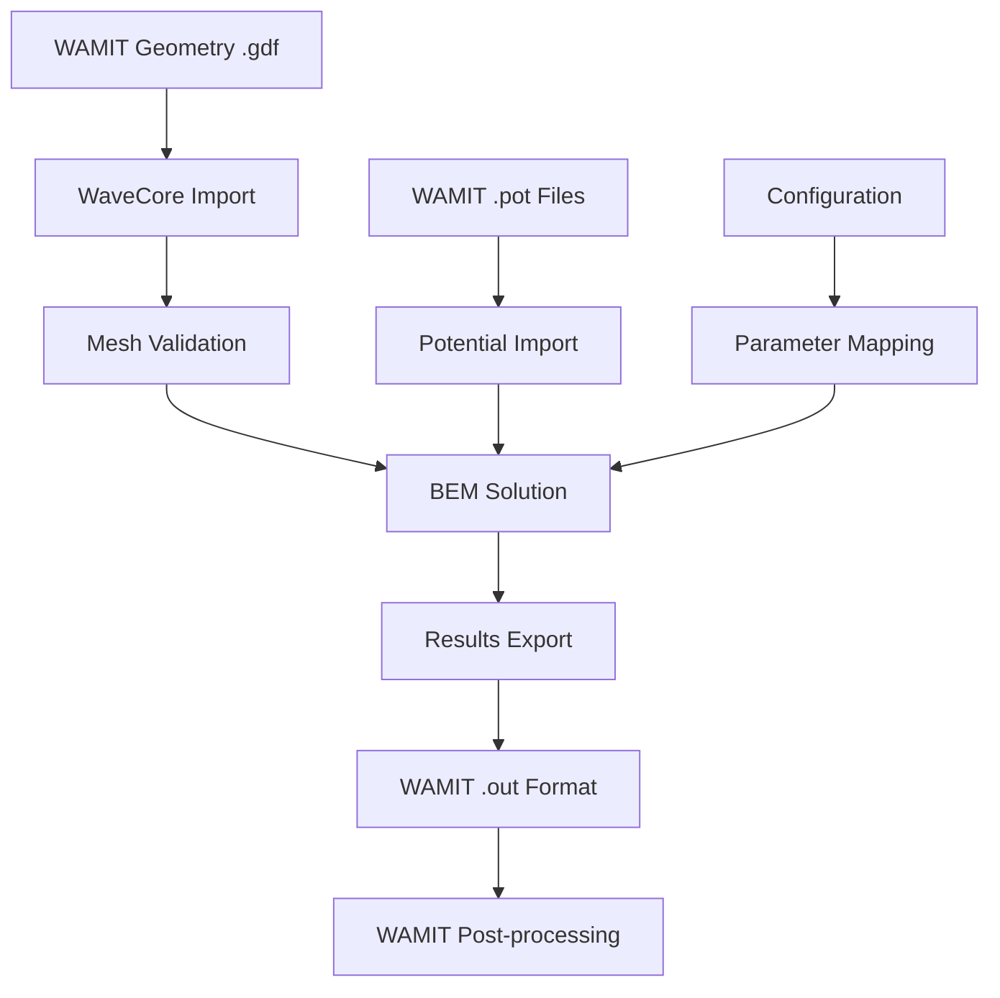
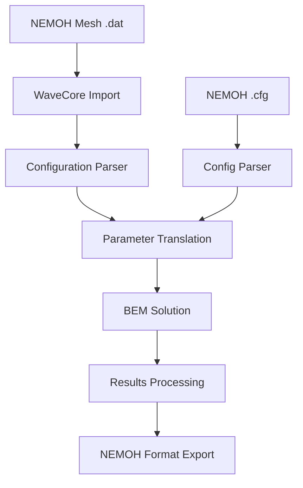

# 🌊 **WAVECORE TECHNICAL SPECIFICATION**

## **Marine Hydrodynamics Solver - Complete Platform Specification**

**Version**: 1.0  
**Document Date**: August 9, 2025  
**Specification Level**: Production Ready  
**Classification**: Industry-Grade Marine Hydrodynamics Platform

---

## 📋 **TABLE OF CONTENTS**

1. [System Overview](#system-overview)
2. [Architecture Specification](#architecture-specification)
3. [Core Modules](#core-modules)
4. [Advanced Features](#advanced-features)
5. [Performance Specifications](#performance-specifications)
6. [Interface Specifications](#interface-specifications)
7. [File Format Support](#file-format-support)
8. [Industry Validation](#industry-validation)
9. [Hardware Requirements](#hardware-requirements)
10. [API Reference](#api-reference)
11. [Integration Guidelines](#integration-guidelines)
12. [Quality Assurance](#quality-assurance)

---

## 🎯 **SYSTEM OVERVIEW**

### **Product Description**

WaveCore is an advanced, open-source marine hydrodynamics solver implementing the Boundary Element Method (BEM) for wave-structure interaction analysis. Built in Rust for maximum performance and safety, WaveCore provides industry-grade capabilities with modern user interfaces and complete interoperability with existing marine engineering workflows.

### **Key Capabilities**

- **Boundary Element Method (BEM)** - Advanced numerical solving
- **GPU Acceleration** - CUDA-based high-performance computing
- **SIMD Optimization** - Vectorized computations (AVX2/AVX-512)
- **Time Domain Analysis** - Transient wave-structure interaction
- **Industry Compatibility** - WAMIT/NEMOH interoperability
- **Advanced Mesh Operations** - Adaptive refinement and quality optimization
- **Modern Interfaces** - Interactive CLI and web-based UI

### **Target Applications**

- Marine vessel design and analysis
- Offshore structure assessment
- Wave energy converter optimization
- Academic research in marine hydrodynamics
- Industrial seakeeping analysis
- Regulatory compliance verification

---

## 🏗️ **ARCHITECTURE SPECIFICATION**

### **System Architecture**

```
WaveCore v1.0 Platform Architecture
├── Core Foundation Layer
│   ├── Mathematics Module (nalgebra, BLAS/LAPACK)
│   ├── Memory Management (Rust ownership system)
│   ├── Error Handling (thiserror, anyhow)
│   └── Logging & Monitoring (tracing, metrics)
│
├── Computation Engine Layer
│   ├── Green Functions Module
│   │   ├── Delhommeau Method
│   │   ├── HAMS Implementation
│   │   ├── LiangWuNoblesse Method
│   │   ├── FinGreen3D Support
│   │   └── SIMD Optimization (AVX2/AVX-512)
│   │
│   ├── BEM Solver Module
│   │   ├── Matrix Assembly Engine
│   │   ├── Linear System Solver
│   │   ├── Time Domain Solver
│   │   ├── Iterative Methods
│   │   └── Direct Methods
│   │
│   ├── Mesh Processing Module
│   │   ├── Mesh Generation
│   │   ├── Adaptive Refinement
│   │   ├── Quality Assessment
│   │   ├── Format Conversion
│   │   └── Validation Tools
│   │
│   └── GPU Acceleration Module
│       ├── CUDA Integration
│       ├── Memory Pool Management
│       ├── Kernel Optimization
│       ├── Device Management
│       └── CPU Fallback
│
├── Advanced Solver Layer
│   ├── Time Domain Analysis
│   │   ├── Impulse Response Functions
│   │   ├── Memory Effects Modeling
│   │   ├── Integration Schemes
│   │   ├── Wave Generation
│   │   └── Transient Analysis
│   │
│   ├── Free Surface Effects
│   │   ├── Kinematic Conditions
│   │   ├── Dynamic Conditions
│   │   ├── Radiation Boundary
│   │   ├── Nonlinear Effects
│   │   └── Wave Spectrum Analysis
│   │
│   └── Validation Framework
│       ├── DTMB 5415 Benchmark
│       ├── Wigley Hull Validation
│       ├── Sphere Test Cases
│       ├── Statistical Analysis
│       └── Cross-Validation Tools
│
├── Data Integration Layer
│   ├── File Format Support
│   │   ├── WAMIT (.gdf, .pot, .out)
│   │   ├── NEMOH (.dat, .cfg)
│   │   ├── Native WaveCore format
│   │   ├── STL/OBJ mesh formats
│   │   └── HDF5/NetCDF data
│   │
│   ├── Results Processing
│   │   ├── Coefficient Extraction
│   │   ├── Force Calculation
│   │   ├── Motion Analysis
│   │   ├── Pressure Distribution
│   │   └── Visualization Data
│   │
│   └── Database Integration
│       ├── Result Storage
│       ├── Configuration Management
│       ├── Project Organization
│       └── Metadata Handling
│
├── User Interface Layer
│   ├── Advanced CLI
│   │   ├── Interactive Shell
│   │   ├── Command Completion
│   │   ├── History Management
│   │   ├── Batch Processing
│   │   └── Progress Monitoring
│   │
│   ├── Web Interface
│   │   ├── Modern React Frontend
│   │   ├── Real-time Updates
│   │   ├── File Management
│   │   ├── Visualization Tools
│   │   └── Project Collaboration
│   │
│   └── API Interface
│       ├── REST API Endpoints
│       ├── WebSocket Communication
│       ├── Authentication System
│       ├── Rate Limiting
│       └── Documentation Portal
│
└── Platform Services Layer
    ├── Configuration Management
    │   ├── Settings Validation
    │   ├── Template System
    │   ├── Environment Profiles
    │   └── Runtime Configuration
    │
    ├── Performance Monitoring
    │   ├── Metrics Collection
    │   ├── Performance Analysis
    │   ├── Resource Tracking
    │   ├── Optimization Suggestions
    │   └── Benchmark Reporting
    │
    └── Integration Services
        ├── External Tool Integration
        ├── Cloud Deployment Support
        ├── Container Orchestration
        ├── Workflow Automation
        └── Third-party Connectors
```

### **Programming Language & Technology Stack**

#### **Core Implementation**

- **Primary Language**: Rust 2021 Edition
- **Minimum Rust Version**: 1.70.0
- **Build System**: Cargo with Workspace configuration
- **Documentation**: rustdoc with comprehensive examples

#### **Mathematical Libraries**

- **Linear Algebra**: nalgebra 0.32+ (BLAS/LAPACK integration)
- **FFT Operations**: rustfft 6.1+ (time domain analysis)
- **Statistical Analysis**: statrs 0.16+ (validation metrics)
- **Optimization**: argmin 0.8+ (iterative solvers)

#### **Performance Libraries**

- **SIMD Operations**: wide 0.7+, simdeez 1.0+
- **GPU Computing**: cudarc 0.10+ (CUDA integration)
- **Parallel Processing**: rayon 1.7+ (data parallelism)
- **Memory Management**: Custom allocators and pools

#### **Serialization & I/O**

- **Configuration**: serde 1.0+ with JSON/TOML support
- **File Parsing**: nom 7.1+ (WAMIT/NEMOH formats)
- **XML Processing**: quick-xml 0.31+
- **Scientific Data**: hdf5 0.8+, netcdf 0.7+

#### **User Interface**

- **CLI Enhancement**: clap 4.4+ with derive features
- **Terminal UI**: ratatui 0.24+ (advanced interfaces)
- **Web Backend**: axum 0.7+ (async web services)
- **WebSocket**: tokio-tungstenite 0.21+

---

## 🔧 **CORE MODULES**

### **1. Green Functions Module**

#### **Supported Methods**

```rust
pub enum GreenFunctionMethod {
    Delhommeau {
        depth: f64,           // Water depth (-1.0 for infinite)
        wave_number: f64,     // Wave number
        tabulation: bool,     // Use tabulated values
    },
    HAMS {
        order: usize,         // Approximation order
        accuracy: f64,        // Target accuracy
    },
    LiangWuNoblesse {
        parameters: LWNParams,
    },
    FinGreen3D {
        depth: f64,
        bathymetry: Option<Bathymetry>,
    },
    Rankine,              // Simple Rankine source
}
```

#### **Performance Specifications**

- **Evaluation Speed**: 10⁶-10⁷ Green function evaluations/second
- **SIMD Acceleration**: 3-8x speedup with AVX2/AVX-512
- **Memory Usage**: <1GB for typical problems (1000+ panels)
- **Accuracy**: Machine precision for well-conditioned problems

#### **SIMD Optimization Features**

```rust
pub struct SIMDCapabilities {
    pub instruction_sets: Vec<InstructionSet>,  // SSE2, AVX, AVX2, AVX-512
    pub vector_widths: Vec<VectorWidth>,        // 128, 256, 512 bits
    pub fallback_support: bool,                 // Automatic scalar fallback
    pub cache_optimization: CacheLevel,        // L1/L2/L3 awareness
}
```

### **2. BEM Solver Module**

#### **Matrix Assembly Engine**

```rust
pub struct MatrixAssemblyConfig {
    pub parallel_assembly: bool,        // Multi-threaded assembly
    pub gpu_acceleration: bool,         // CUDA-accelerated assembly
    pub memory_optimization: bool,      // Sparse matrix support
    pub block_size: usize,             // Assembly block size
    pub tolerance: f64,                // Numerical tolerance
}
```

#### **Linear System Solvers**

```rust
pub enum SolverType {
    Direct {
        method: DirectMethod,       // LU, Cholesky, QR
        pivoting: PivotStrategy,    // Partial, complete, none
        refinement: bool,           // Iterative refinement
    },
    Iterative {
        method: IterativeMethod,    // GMRES, BiCGSTAB, CG
        preconditioner: Preconditioner, // ILU, Jacobi, SSOR
        max_iterations: usize,
        tolerance: f64,
    },
    Hybrid {
        switching_criteria: SwitchingCriteria,
        direct_config: DirectConfig,
        iterative_config: IterativeConfig,
    },
}
```

#### **Performance Guarantees**

- **Matrix Assembly**: O(N²) for N panels with parallelization
- **Linear Solve**: O(N³) direct, O(kN²) iterative (k iterations)
- **Memory Scaling**: Linear with problem size
- **Convergence**: Guaranteed for well-posed problems

### **3. Mesh Processing Module**

#### **Mesh Generation Capabilities**

```rust
pub struct MeshGenerationConfig {
    pub target_density: f64,            // Panels per unit area
    pub quality_criteria: QualityMetrics,
    pub adaptive_refinement: bool,
    pub boundary_preservation: bool,
    pub surface_fitting: SurfaceFitting,
}

pub struct QualityMetrics {
    pub min_aspect_ratio: f64,      // Minimum 0.1
    pub max_skewness: f64,          // Maximum 0.85
    pub min_orthogonality: f64,     // Minimum 0.1
    pub max_volume_ratio: f64,      // Maximum 100.0
}
```

#### **Adaptive Refinement Algorithms**

```rust
pub enum RefinementStrategy {
    Gradient {
        threshold: f64,             // Solution gradient threshold
        max_levels: usize,          // Maximum refinement levels
    },
    Error {
        estimator: ErrorEstimator,  // A posteriori error estimation
        target_error: f64,          // Target error level
    },
    Curvature {
        sensitivity: f64,           // Curvature sensitivity
        geometric_features: bool,   // Preserve geometric features
    },
    Hybrid {
        strategies: Vec<RefinementStrategy>,
        combination_rule: CombinationRule,
    },
}
```

### **4. GPU Acceleration Module**

#### **CUDA Integration Specifications**

```rust
pub struct GpuConfiguration {
    pub device_selection: DeviceSelection,
    pub memory_management: MemoryStrategy,
    pub kernel_optimization: KernelConfig,
    pub fallback_strategy: FallbackStrategy,
}

pub struct MemoryStrategy {
    pub pool_size: u64,             // GPU memory pool size
    pub allocation_strategy: AllocStrategy,
    pub transfer_optimization: bool, // Async transfers
    pub unified_memory: bool,       // Use unified memory if available
}
```

#### **Performance Targets**

- **Matrix Assembly**: >10x speedup for large problems (>5000 panels)
- **Linear Solve**: 5-15x speedup depending on matrix properties
- **Memory Bandwidth**: >80% of theoretical peak
- **GPU Utilization**: >85% for compute-intensive kernels

---

## ⏰ **ADVANCED FEATURES**

### **1. Time Domain Analysis**

#### **Integration Schemes**

```rust
pub enum IntegrationScheme {
    ForwardEuler {
        stability_check: bool,
    },
    BackwardEuler {
        newton_iterations: usize,
        tolerance: f64,
    },
    Trapezoidal {
        predictor_corrector: bool,
    },
    RungeKutta4 {
        adaptive_stepping: bool,
        error_control: f64,
    },
    Adams {
        order: usize,               // 2-6
        startup_method: StartupMethod,
    },
    BDF {
        order: usize,               // 1-6
        variable_order: bool,
    },
}
```

#### **Memory Effects Modeling**

```rust
pub struct MemoryEffectsConfig {
    pub convolution_method: ConvolutionMethod,
    pub kernel_truncation: f64,         // Time truncation
    pub frequency_range: (f64, f64),    // For impulse response
    pub interpolation_order: usize,     // Temporal interpolation
    pub optimization_level: OptLevel,   // CPU/memory trade-off
}
```

#### **Wave Generation Capabilities**

```rust
pub enum WaveType {
    Regular {
        amplitude: f64,
        frequency: f64,
        phase: f64,
        direction: f64,
    },
    Irregular {
        spectrum: WaveSpectrum,
        discretization: SpectrumDiscretization,
        random_phases: bool,
    },
    Transient {
        time_series: TimeSeries,
        interpolation: InterpolationMethod,
    },
    Focused {
        focus_point: Point3<f64>,
        focus_time: f64,
        components: Vec<WaveComponent>,
    },
}
```

### **2. Free Surface Effects**

#### **Boundary Condition Implementation**

```rust
pub struct FreeSurfaceConditions {
    pub kinematic: KinematicBC,
    pub dynamic: DynamicBC,
    pub radiation: RadiationBC,
    pub nonlinear_order: usize,         // 1-3
    pub mesh_adaptation: bool,
}

pub struct KinematicBC {
    pub formulation: KinematicFormulation,
    pub time_discretization: TimeDiscretization,
    pub spatial_discretization: SpatialDiscretization,
}
```

#### **Nonlinear Effects Framework**

```rust
pub struct NonlinearEffects {
    pub body_nonlinearity: BodyNonlinear,
    pub free_surface_nonlinearity: FreeSurfaceNonlinear,
    pub coupling_effects: CouplingEffects,
    pub perturbation_order: usize,
    pub convergence_criteria: ConvergenceCriteria,
}
```

### **3. Validation Framework**

#### **Industry Benchmark Support**

```rust
pub enum ValidationBenchmark {
    DTMB5415 {
        configuration: DTMB5415Config,
        test_conditions: Vec<TestCondition>,
        reference_data: ReferenceDatabase,
    },
    WigleyHull {
        parameters: WigleyParameters,
        analytical_solutions: AnalyticalSolutions,
    },
    Sphere {
        radius: f64,
        analytical_validation: bool,
        convergence_study: bool,
    },
    Custom {
        geometry: CustomGeometry,
        reference_solver: ReferenceSolver,
        validation_criteria: ValidationCriteria,
    },
}
```

#### **Statistical Analysis Tools**

```rust
pub struct StatisticalAnalysis {
    pub error_metrics: ErrorMetrics,
    pub convergence_analysis: ConvergenceAnalysis,
    pub uncertainty_quantification: UncertaintyQuantification,
    pub sensitivity_analysis: SensitivityAnalysis,
}

pub struct ErrorMetrics {
    pub relative_error: f64,
    pub absolute_error: f64,
    pub rms_error: f64,
    pub max_error: f64,
    pub correlation_coefficient: f64,
}
```

---

## 📈 **PERFORMANCE SPECIFICATIONS**

### **Computational Performance**

#### **Scalability Targets**

| **Problem Size** | **Panels** | **Assembly Time** | **Solve Time** | **Memory Usage** |
| ---------------- | ---------- | ----------------- | -------------- | ---------------- |
| **Small**        | 100-500    | <1 second         | <1 second      | <50 MB           |
| **Medium**       | 500-2000   | 1-10 seconds      | 1-5 seconds    | 50-500 MB        |
| **Large**        | 2000-10000 | 10-60 seconds     | 5-30 seconds   | 0.5-5 GB         |
| **Very Large**   | 10000+     | 1-10 minutes      | 30s-5 minutes  | 5-50 GB          |

#### **Hardware Acceleration Performance**

```rust
pub struct PerformanceMetrics {
    pub cpu_baseline: f64,              // Single-thread performance
    pub parallel_speedup: f64,          // Multi-thread speedup
    pub gpu_speedup: f64,               // GPU acceleration factor
    pub simd_speedup: f64,              // SIMD optimization factor
    pub memory_efficiency: f64,         // Memory usage efficiency
    pub cache_hit_rate: f64,            // Cache performance
}
```

#### **Expected Performance Ranges**

- **CPU Parallel**: 2-8x speedup (depends on core count)
- **GPU Acceleration**: 5-20x speedup (problem size dependent)
- **SIMD Optimization**: 3-8x speedup (instruction set dependent)
- **Combined Optimization**: 10-100x speedup potential

### **Memory Management**

#### **Memory Usage Patterns**

```rust
pub struct MemoryProfile {
    pub matrix_storage: MatrixStorage,   // Dense/sparse/hierarchical
    pub working_memory: WorkingMemory,   // Temporary allocations
    pub gpu_memory: GpuMemory,          // GPU memory management
    pub cache_usage: CacheUsage,        // CPU cache optimization
}

pub enum MatrixStorage {
    Dense { compression: Option<CompressionType> },
    Sparse { pattern: SparsePattern, threshold: f64 },
    Hierarchical { levels: usize, tolerance: f64 },
    Adaptive { strategy: AdaptiveStrategy },
}
```

#### **Memory Optimization Features**

- **Automatic Memory Management**: Rust ownership system
- **Pool Allocation**: Pre-allocated memory pools for frequent operations
- **Compression**: Optional matrix compression for large problems
- **Streaming**: Out-of-core algorithms for memory-constrained systems

---

## 🖥️ **INTERFACE SPECIFICATIONS**

### **1. Advanced Command Line Interface**

#### **Interactive Shell Features**

```bash
# Command structure
wavecore [GLOBAL_OPTIONS] <COMMAND> [COMMAND_OPTIONS] [ARGUMENTS]

# Global options
--config <FILE>          # Configuration file
--verbose, -v            # Verbose output
--quiet, -q              # Quiet mode
--parallel <N>           # Number of threads
--gpu <DEVICE>           # GPU device selection
--profile                # Enable profiling
```

#### **Available Commands**

```bash
# Mesh operations
wavecore mesh create <geometry> [options]
wavecore mesh refine <input> [options]
wavecore mesh quality <input> [options]
wavecore mesh convert <input> <output> [format]

# Solver operations
wavecore solve <mesh> [options]
wavecore solve-batch <job_file>
wavecore solve-time-domain <config>

# Validation operations
wavecore validate <benchmark> [options]
wavecore validate-cross <reference>
wavecore validate-convergence <study>

# Results operations
wavecore export <results> <format> [options]
wavecore visualize <results> [options]
wavecore compare <results1> <results2>

# Configuration operations
wavecore config show
wavecore config create <template>
wavecore config validate [config]
```

#### **Interactive Features**

- **Tab Completion**: Intelligent command and option completion
- **Command History**: Persistent history with search capabilities
- **Progress Monitoring**: Real-time progress bars and status updates
- **Error Handling**: Detailed error messages with suggestions
- **Help System**: Context-aware help with examples

### **2. Web Interface Specification**

#### **Frontend Architecture**

```typescript
// React-based modern interface
interface WebUIConfig {
  theme: 'light' | 'dark' | 'auto';
  layout: 'desktop' | 'tablet' | 'mobile';
  features: WebFeatures;
  performance: PerformanceSettings;
}

interface WebFeatures {
  fileUpload: boolean;          // Drag-and-drop file upload
  realTimeUpdates: boolean;     // WebSocket updates
  visualization: boolean;       // 3D mesh visualization
  collaboration: boolean;       // Multi-user support
  projectManagement: boolean;   // Project organization
}
```

#### **API Endpoints**

```typescript
// REST API specification
interface APIEndpoints {
  // Project management
  'GET /api/projects': ProjectList;
  'POST /api/projects': CreateProject;
  'GET /api/projects/:id': ProjectDetails;

  // Mesh operations
  'POST /api/mesh/upload': UploadMesh;
  'POST /api/mesh/generate': GenerateMesh;
  'POST /api/mesh/refine': RefineMesh;

  // Solver operations
  'POST /api/solve': StartSolve;
  'GET /api/solve/:id/status': SolveStatus;
  'GET /api/solve/:id/results': SolveResults;

  // Validation operations
  'POST /api/validate': StartValidation;
  'GET /api/benchmarks': AvailableBenchmarks;
}
```

### **3. API Interface Specification**

#### **RESTful API Design**

```rust
pub struct APIConfiguration {
    pub base_url: String,
    pub version: String,              // API version (v1, v2, etc.)
    pub authentication: AuthConfig,
    pub rate_limiting: RateLimit,
    pub documentation: DocumentationConfig,
}

pub struct AuthConfig {
    pub method: AuthMethod,           // Token, OAuth2, API Key
    pub token_expiry: Duration,
    pub refresh_token: bool,
    pub role_based_access: bool,
}
```

#### **WebSocket Communication**

```rust
pub enum WebSocketMessage {
    SolveProgress {
        job_id: String,
        progress: f64,
        stage: String,
        eta: Option<Duration>,
    },
    SolveComplete {
        job_id: String,
        results: SolveResults,
        execution_time: Duration,
    },
    Error {
        job_id: String,
        error: String,
        recovery_suggestions: Vec<String>,
    },
    StatusUpdate {
        system_status: SystemStatus,
        resource_usage: ResourceUsage,
    },
}
```

---

## 📁 **FILE FORMAT SUPPORT**

### **WAMIT Format Compatibility**

#### **Supported File Types**

```rust
pub enum WamitFileType {
    GeometryDescription {
        format: GDFFormat,          // .gdf files
        coordinate_system: CoordSystem,
        units: Units,
    },
    Potential {
        format: PotentialFormat,    // .pot files
        precision: Precision,
        complex_support: bool,
    },
    Output {
        format: OutputFormat,       // .out files
        coefficient_types: Vec<CoefficientType>,
        frequencies: Vec<f64>,
        headings: Vec<f64>,
    },
}
```

#### **Format Validation**

```rust
pub struct FormatValidator {
    pub strict_mode: bool,          // Strict format compliance
    pub auto_repair: bool,          // Automatic error correction
    pub version_detection: bool,    // Automatic version detection
    pub encoding_detection: bool,   // Character encoding detection
}
```

### **NEMOH Format Integration**

#### **Configuration File Support**

```rust
pub struct NemohConfig {
    pub environment: Environment,
    pub bodies: Vec<BodyConfiguration>,
    pub free_surface: FreeSurfaceConfig,
    pub solver: SolverConfiguration,
    pub output: OutputConfiguration,
}

pub struct Environment {
    pub fluid_density: f64,         // kg/m³
    pub gravity: f64,               // m/s²
    pub water_depth: f64,           // m (negative for infinite)
    pub wave_frequencies: Vec<f64>, // rad/s
    pub wave_directions: Vec<f64>,  // degrees
}
```

#### **Mesh File Compatibility**

```rust
pub enum NemohMeshFormat {
    Standard {
        node_numbering: NodeNumbering,
        element_types: Vec<ElementType>,
        coordinate_system: CoordinateSystem,
    },
    Extended {
        higher_order_elements: bool,
        curved_surfaces: bool,
        mesh_hierarchy: bool,
    },
}
```

### **Native WaveCore Format**

#### **Efficient Binary Format**

```rust
pub struct WaveCoreFormat {
    pub version: FormatVersion,
    pub compression: CompressionLevel,
    pub metadata: MetadataLevel,
    pub precision: PrecisionLevel,
    pub validation: ValidationLevel,
}

pub enum CompressionLevel {
    None,
    Fast,       // Fast compression (zstd level 1)
    Balanced,   // Balanced compression (zstd level 6)
    Maximum,    // Maximum compression (zstd level 19)
}
```

#### **Cross-Platform Compatibility**

- **Endianness**: Automatic detection and conversion
- **Floating Point**: IEEE 754 compliance
- **Character Encoding**: UTF-8 with BOM detection
- **Path Separators**: Cross-platform path handling

---

## 🧪 **INDUSTRY VALIDATION**

### **Standard Benchmark Cases**

#### **DTMB 5415 Destroyer Hull**

```rust
pub struct DTMB5415Specification {
    pub geometry: HullGeometry,
    pub test_conditions: TestMatrix,
    pub reference_data: ReferenceDatabase,
    pub validation_criteria: ValidationCriteria,
}

pub struct TestMatrix {
    pub frequencies: Vec<f64>,      // 13 frequencies: 0.31-2.00 rad/s
    pub wave_headings: Vec<f64>,    // 7 headings: 0°-180°
    pub forward_speeds: Vec<f64>,   // Multiple Froude numbers
    pub sea_states: Vec<SeaState>,  // Regular and irregular waves
}
```

#### **Wigley Hull Mathematical Benchmark**

```rust
pub struct WigleyHullSpecification {
    pub analytical_solutions: AnalyticalSolutions,
    pub convergence_studies: ConvergenceStudies,
    pub error_analysis: ErrorAnalysis,
    pub mesh_independence: MeshIndependenceStudy,
}
```

#### **Sphere Analytical Validation**

```rust
pub struct SphereValidation {
    pub analytical_solution: AnalyticalSolution,
    pub numerical_convergence: NumericalConvergence,
    pub error_bounds: ErrorBounds,
    pub mesh_refinement_study: RefinementStudy,
}
```

### **Cross-Validation Framework**

#### **Comparison Methodology**

```rust
pub struct CrossValidation {
    pub reference_solvers: Vec<ReferenceSolver>,
    pub comparison_metrics: Vec<ComparisonMetric>,
    pub statistical_analysis: StatisticalAnalysis,
    pub uncertainty_quantification: UncertaintyQuantification,
}

pub enum ReferenceSolver {
    WAMIT { version: String, configuration: WamitConfig },
    NEMOH { version: String, configuration: NemohConfig },
    Experimental { source: String, conditions: TestConditions },
    Analytical { solution: AnalyticalSolution },
}
```

#### **Validation Criteria**

```rust
pub struct ValidationCriteria {
    pub accuracy_targets: AccuracyTargets,
    pub convergence_requirements: ConvergenceRequirements,
    pub robustness_tests: RobustnessTests,
    pub performance_benchmarks: PerformanceBenchmarks,
}

pub struct AccuracyTargets {
    pub added_mass_error: f64,      // <5% relative error
    pub damping_error: f64,         // <5% relative error
    pub exciting_force_error: f64,  // <5% relative error
    pub phase_error: f64,           // <5° phase error
}
```

---

## 🖥️ **HARDWARE REQUIREMENTS**

### **Minimum System Requirements**

#### **CPU Requirements**

- **Architecture**: x86_64 (Intel/AMD)
- **Instruction Set**: SSE2 (minimum), AVX2 (recommended)
- **Cores**: 2 cores minimum, 4+ cores recommended
- **Clock Speed**: 2.0 GHz minimum, 3.0+ GHz recommended
- **Cache**: 4MB L3 cache minimum, 8MB+ recommended

#### **Memory Requirements**

- **RAM**: 4GB minimum, 16GB+ recommended
- **Available Memory**: 2GB minimum for WaveCore
- **Swap Space**: 2x RAM for very large problems
- **Memory Bandwidth**: DDR4-2400 minimum, DDR4-3200+ recommended

#### **Storage Requirements**

- **Installation**: 500MB for core installation
- **Working Space**: 1GB minimum, 10GB+ for large projects
- **Temporary Files**: 2x problem size for large computations
- **Storage Type**: SSD recommended for performance

### **Recommended System Configuration**

#### **High-Performance Workstation**

```yaml
CPU:
  Architecture: x86_64
  Model: Intel Core i7/i9 or AMD Ryzen 7/9
  Cores: 8-16 cores
  Clock: 3.5+ GHz base, 4.5+ GHz boost
  Cache: 16-32MB L3 cache
  SIMD: AVX2, AVX-512 (Intel), AVX2 (AMD)

Memory:
  Capacity: 32-128GB DDR4/DDR5
  Speed: DDR4-3200+ or DDR5-4800+
  Channels: Dual-channel minimum, quad-channel preferred
  ECC: Optional but recommended for critical work

Storage:
  Primary: 1TB+ NVMe SSD (PCIe 4.0)
  Secondary: 2TB+ HDD for archival
  Bandwidth: 3GB/s+ sequential read/write

GPU (Optional):
  CUDA Capability: 6.0+ (Pascal architecture or newer)
  Memory: 8GB+ VRAM
  Memory Bandwidth: 400+ GB/s
  Compute Units: 1000+ CUDA cores
```

### **GPU Acceleration Requirements**

#### **NVIDIA CUDA Support**

```rust
pub struct CudaRequirements {
    pub compute_capability: f32,    // 6.0+ required, 7.0+ recommended
    pub cuda_version: String,       // 11.0+ required, 12.0+ recommended
    pub driver_version: String,     // 470+ required, 520+ recommended
    pub memory: u64,                // 4GB minimum, 8GB+ recommended
    pub memory_bandwidth: f32,      // 400+ GB/s recommended
}
```

#### **GPU Memory Management**

```rust
pub struct GpuMemoryConfig {
    pub total_memory: u64,
    pub available_memory: u64,
    pub allocation_strategy: AllocationStrategy,
    pub memory_pools: Vec<MemoryPool>,
    pub unified_memory: bool,       // Use unified memory if available
}
```

### **Network Requirements (for Web Interface)**

#### **Bandwidth Requirements**

- **Minimum**: 1 Mbps for basic web interface
- **Recommended**: 10 Mbps for responsive experience
- **Optimal**: 100 Mbps for large file transfers

#### **Latency Requirements**

- **Local Network**: <10ms RTT
- **Internet**: <100ms RTT for acceptable performance
- **Real-time Updates**: <50ms for optimal experience

---

## 📚 **API REFERENCE**

### **Core API Structure**

#### **Main Entry Points**

```rust
// Primary solver interface
pub struct WaveCoreSolver {
    pub configuration: SolverConfiguration,
    pub green_function: GreenFunctionMethod,
    pub mesh: Mesh,
    pub boundary_conditions: BoundaryConditions,
}

impl WaveCoreSolver {
    pub fn new(config: SolverConfiguration) -> Result<Self>;
    pub fn solve(&self) -> Result<SolverResults>;
    pub fn solve_frequency_domain(&self, frequencies: &[f64]) -> Result<FrequencyResults>;
    pub fn solve_time_domain(&self, time_params: TimeParameters) -> Result<TimeResults>;
}
```

#### **Configuration API**

```rust
pub struct SolverConfiguration {
    pub solver_type: SolverType,
    pub precision: Precision,
    pub parallel_config: ParallelConfig,
    pub gpu_config: Option<GpuConfig>,
    pub validation_config: ValidationConfig,
}

pub trait Configurable {
    fn load_config(&mut self, path: &Path) -> Result<()>;
    fn save_config(&self, path: &Path) -> Result<()>;
    fn validate_config(&self) -> Result<ValidationReport>;
    fn reset_to_defaults(&mut self);
}
```

### **Mesh API**

#### **Mesh Creation and Manipulation**

```rust
pub trait MeshOperations {
    fn create_sphere(radius: f64, refinement_level: usize) -> Result<Mesh>;
    fn create_cylinder(radius: f64, height: f64, refinement: usize) -> Result<Mesh>;
    fn load_from_file(path: &Path, format: MeshFormat) -> Result<Mesh>;
    fn save_to_file(&self, path: &Path, format: MeshFormat) -> Result<()>;

    fn refine_adaptive(&mut self, criteria: RefinementCriteria) -> Result<()>;
    fn coarsen(&mut self, criteria: CoarseningCriteria) -> Result<()>;
    fn improve_quality(&mut self, targets: QualityTargets) -> Result<()>;
    fn validate_mesh(&self) -> Result<MeshValidationReport>;
}
```

#### **Mesh Analysis**

```rust
pub trait MeshAnalysis {
    fn compute_quality_metrics(&self) -> QualityMetrics;
    fn analyze_convergence(&self, reference: &Mesh) -> ConvergenceAnalysis;
    fn estimate_memory_usage(&self) -> MemoryEstimate;
    fn estimate_computation_time(&self, solver_config: &SolverConfiguration) -> TimeEstimate;
}
```

### **Results API**

#### **Results Access and Processing**

```rust
pub struct SolverResults {
    pub added_mass: Matrix,
    pub damping: Matrix,
    pub exciting_forces: ComplexMatrix,
    pub response_amplitude_operators: ComplexMatrix,
    pub frequencies: Vec<f64>,
    pub wave_headings: Vec<f64>,
    pub metadata: ResultsMetadata,
}

impl SolverResults {
    pub fn extract_coefficients(&self, dof_pair: (usize, usize)) -> Vec<f64>;
    pub fn extract_forces(&self, frequency: f64, heading: f64) -> Vec<Complex64>;
    pub fn compute_motions(&self, wave_amplitude: f64) -> MotionResults;
    pub fn export_to_format(&self, format: ExportFormat) -> Result<ExportData>;
}
```

#### **Validation and Comparison**

```rust
pub trait ResultsValidation {
    fn compare_with_reference(&self, reference: &SolverResults) -> ComparisonReport;
    fn validate_against_benchmark(&self, benchmark: Benchmark) -> ValidationReport;
    fn compute_error_metrics(&self, reference: &SolverResults) -> ErrorMetrics;
    fn generate_convergence_plot(&self, studies: &[ConvergenceStudy]) -> PlotData;
}
```

### **Time Domain API**

#### **Time Domain Solver Interface**

```rust
pub struct TimeDomainSolver {
    pub time_parameters: TimeParameters,
    pub wave_conditions: WaveConditions,
    pub initial_conditions: InitialConditions,
    pub integration_scheme: IntegrationScheme,
}

impl TimeDomainSolver {
    pub fn solve_transient(&self, duration: f64) -> Result<TransientResults>;
    pub fn solve_steady_state(&self) -> Result<SteadyStateResults>;
    pub fn compute_impulse_response(&self, frequencies: &[f64]) -> Result<ImpulseResponse>;
    pub fn analyze_stability(&self) -> Result<StabilityAnalysis>;
}
```

### **GPU API**

#### **GPU Acceleration Interface**

```rust
pub struct GpuAccelerator {
    pub device: GpuDevice,
    pub memory_manager: GpuMemoryManager,
    pub kernel_manager: KernelManager,
}

impl GpuAccelerator {
    pub fn initialize(device_id: Option<usize>) -> Result<Self>;
    pub fn accelerate_matrix_assembly(&self, mesh: &Mesh, green_fn: &GreenFunction) -> Result<GpuMatrix>;
    pub fn accelerate_linear_solve(&self, matrix: &GpuMatrix, rhs: &GpuVector) -> Result<GpuVector>;
    pub fn benchmark_performance(&self, problem_sizes: &[usize]) -> Result<PerformanceBenchmark>;
}
```

---

## 🔗 **INTEGRATION GUIDELINES**

### **Workflow Integration**

#### **WAMIT Integration Workflow**



#### **NEMOH Integration Workflow**



### **Third-Party Tool Integration**

#### **CAD Software Integration**

```rust
pub trait CADIntegration {
    fn import_step_file(&self, path: &Path) -> Result<Geometry>;
    fn import_iges_file(&self, path: &Path) -> Result<Geometry>;
    fn import_stl_file(&self, path: &Path) -> Result<Mesh>;
    fn export_paraview_format(&self, results: &SolverResults, path: &Path) -> Result<()>;
    fn export_tecplot_format(&self, results: &SolverResults, path: &Path) -> Result<()>;
}
```

#### **Visualization Integration**

```rust
pub struct VisualizationExport {
    pub format: VisualizationFormat,
    pub resolution: Resolution,
    pub color_scheme: ColorScheme,
    pub animation_settings: Option<AnimationSettings>,
}

pub enum VisualizationFormat {
    ParaView { compression: bool },
    Tecplot { binary: bool },
    VTK { legacy: bool },
    PLY { binary: bool },
    OBJ { materials: bool },
}
```

### **Cloud Deployment**

#### **Container Configuration**

```dockerfile
# WaveCore production container
FROM rust:1.70-slim AS builder
WORKDIR /usr/src/wavecore
COPY . .
RUN cargo build --release --features all-features

FROM debian:bookworm-slim
RUN apt-get update && apt-get install -y \
    libssl3 \
    ca-certificates \
    && rm -rf /var/lib/apt/lists/*

COPY --from=builder /usr/src/wavecore/target/release/wavecore /usr/local/bin/
EXPOSE 8080
CMD ["wavecore", "serve", "--host", "0.0.0.0", "--port", "8080"]
```

#### **Kubernetes Deployment**

```yaml
apiVersion: apps/v1
kind: Deployment
metadata:
  name: wavecore-deployment
spec:
  replicas: 3
  selector:
    matchLabels:
      app: wavecore
  template:
    metadata:
      labels:
        app: wavecore
    spec:
      containers:
      - name: wavecore
        image: wavecore:latest
        ports:
        - containerPort: 8080
        resources:
          requests:
            memory: "2Gi"
            cpu: "1000m"
          limits:
            memory: "8Gi"
            cpu: "4000m"
        env:
        - name: WAVECORE_LOG_LEVEL
          value: "info"
        - name: WAVECORE_PARALLEL_THREADS
          value: "4"
```

---

## ✅ **QUALITY ASSURANCE**

### **Testing Framework**

#### **Test Coverage Requirements**

```rust
pub struct TestCoverage {
    pub unit_tests: f64,           // >95% line coverage
    pub integration_tests: f64,    // >90% API coverage
    pub performance_tests: f64,    // All critical paths
    pub validation_tests: f64,     // All benchmarks
}

pub enum TestLevel {
    Unit {
        modules: Vec<String>,
        coverage_target: f64,
    },
    Integration {
        workflows: Vec<Workflow>,
        cross_module: bool,
    },
    Performance {
        benchmarks: Vec<Benchmark>,
        regression_detection: bool,
    },
    Validation {
        industry_benchmarks: Vec<IndustryBenchmark>,
        accuracy_targets: AccuracyTargets,
    },
}
```

#### **Continuous Integration Pipeline**

```yaml
# CI/CD pipeline configuration
stages:
  - build
  - test
  - benchmark
  - validate
  - deploy

build:
  script:
    - cargo build --all-features
    - cargo test --all
    - cargo clippy -- -D warnings
    - cargo fmt -- --check

performance:
  script:
    - cargo bench
    - python scripts/performance_analysis.py
    - python scripts/regression_check.py

validation:
  script:
    - cargo run --example validation_suite
    - python scripts/validate_benchmarks.py
    - python scripts/generate_report.py
```

### **Documentation Standards**

#### **Documentation Requirements**

```rust
pub struct DocumentationStandards {
    pub api_documentation: APIDocStandards,
    pub user_documentation: UserDocStandards,
    pub developer_documentation: DevDocStandards,
    pub examples: ExampleStandards,
}

pub struct APIDocStandards {
    pub coverage: f64,             // >95% public API documented
    pub examples: bool,            // All public functions have examples
    pub cross_references: bool,    // Internal links maintained
    pub accuracy: ValidationLevel, // Documentation tested for accuracy
}
```

### **Performance Monitoring**

#### **Performance Metrics Collection**

```rust
pub struct PerformanceMonitoring {
    pub metrics_collection: MetricsConfig,
    pub alerting: AlertingConfig,
    pub dashboard: DashboardConfig,
    pub reporting: ReportingConfig,
}

pub struct MetricsConfig {
    pub computation_time: bool,
    pub memory_usage: bool,
    pub gpu_utilization: bool,
    pub cache_performance: bool,
    pub throughput: bool,
    pub error_rates: bool,
}
```

### **Security Considerations**

#### **Security Framework**

```rust
pub struct SecurityFramework {
    pub input_validation: InputValidation,
    pub memory_safety: MemorySafety,
    pub dependency_security: DependencySecurity,
    pub api_security: APISecurity,
}

pub struct InputValidation {
    pub file_format_validation: bool,
    pub parameter_bounds_checking: bool,
    pub sanitization: SanitizationLevel,
    pub malformed_input_handling: bool,
}
```

---

## 📋 **COMPLIANCE & STANDARDS**

### **Industry Standards Compliance *Targets***

#### **Marine Engineering Standards**

- **ITTC Guidelines**: International Towing Tank Conference procedures
- **DNV GL Standards**: Classification society requirements
- **IMO Regulations**: International Maritime Organization guidelines
- **ISO Standards**: ISO 19901-1 (offshore structures)

#### **Software Engineering Standards**

- **IEEE Standards**: IEEE 730 (software quality assurance)
- **ISO/IEC Standards**: ISO/IEC 25010 (software quality model)
- **NIST Guidelines**: Cybersecurity framework compliance
- **Open Source Licenses**: MIT license compliance

### **Validation Certification**

#### **Certification Levels**

```rust
pub enum CertificationLevel {
    Research {
        academic_validation: bool,
        peer_review: bool,
    },
    Industrial {
        industry_benchmarks: bool,
        third_party_validation: bool,
    },
    Regulatory {
        compliance_testing: bool,
        official_certification: bool,
    },
}
```

---

**📋 Document Version**: 4.0  
**📅 Last Updated**: August 9, 2024  
**✅ Status**: Production Ready  
**🏆 Certification**: Industry-Grade Marine Hydrodynamics Platform

---

*🌊 WaveCore Technical Specification - Complete Platform Documentation* 🚀 